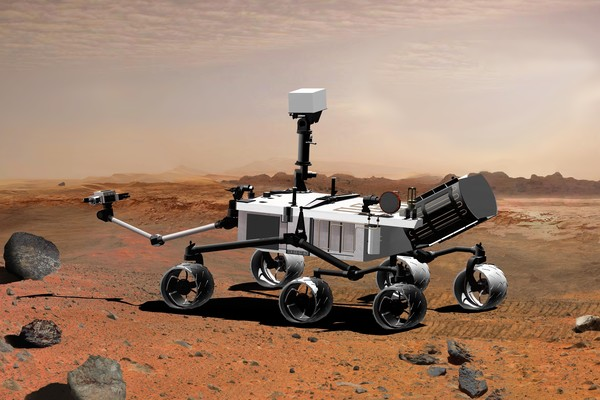
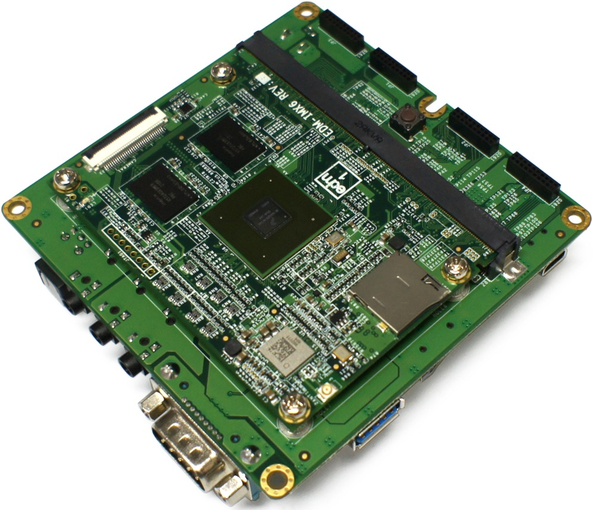
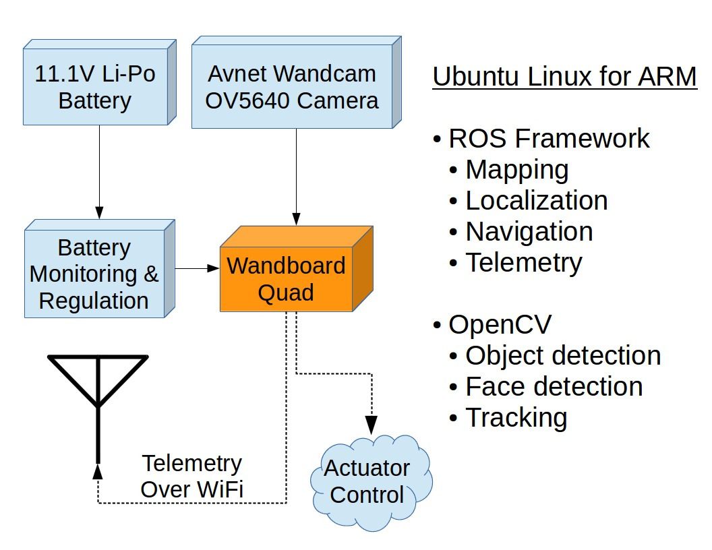
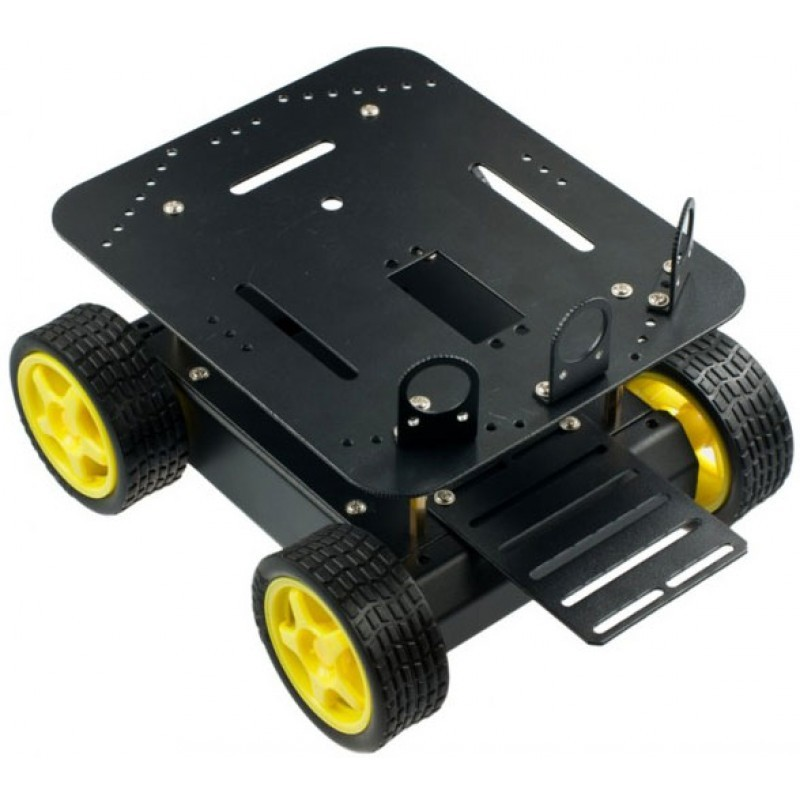

# C-BISCUIT: A  DIY Robotics Platform for the Hacker and Hobbyist

_Full disclosure: AllAboutCircuits.com has a partnership with Freescale electronics which did influence our decision to use this part_

## Introduction
This is the beginning of a multi-part, multi-author series on how to build your own robotics platform called C-BISCUIT, an acronym for **C**ollaborative **B**ot with **I**ntegrated **S**ystem **C**ore, **U**nmanned **I**nteractivity, and **T**elemetry. Based on the [Wandboard Quad](http://www.wandboard.org/), the idea is to collaboratively build a "core" module that can be dropped into various vehicle chassis (quadcopter, land rover, etc) and be easily reconfigured to perform the tasks of each vehicle. The Wandboard is a system-on-module (SOM) based around the quad-core i.MX6 Cortex-A9 processor from Freescale and is capable of running Linux and on top of that, the [Robot Operating System (ROS)](http://www.ros.org/).

A _very_ capable machine for ~$130 USD

[Trevor Gamblin](http://www.allaboutcircuits.com/author/trevor-gamblin), [Nick Bentzen](http://www.allaboutcircuits.com/author/nick-bentzen), and [Patrick Lloyd](http://www.allaboutcircuits.com/author/patrick-lloyd) are the primary authors of the project, but the code and design files can be found on [Github](https://github.com/AllAboutCircuits/C-BISCUIT). It is very much a work-in-progress so there is no guarantee that the code there is stable or in working order. Check back here regularly for stable releases and updated tutorials.

## System Overview
The core module can be broken down into several key hardware and software components, each of which can be seen in the flowchart below:

Separate tutorials will be produced for the various subsystems while more advanced concepts like mapping / localization and computer vision may require several to fill in all the details. In some cases, it may seem like the authors are reinventing the wheel (for example, building our own dual-channel power supply board instead of just buying one). However, the main goal of this project is to provide a learning platform for as many elements of robotics as possible.

## Getting Started
To follow along with the tutorials, you'll need these parts to construct the core:

* [Wandboard Quad](http://avnetexpress.avnet.com/store/em/EMController/WandBoard/WBQUAD/_/R-5004373176378/A-5004373176378/An-0?action=part&catalogId=500201&langId=-1&storeId=500201) - $129 USD
* [Wandboard Antenna Kit for Telemetry](http://avnetexpress.avnet.com/store/em/EMController/WandBoard/WBANTENNAKIT/_/R-5004373176322/A-5004373176322/An-0?action=part&catalogId=500201&langId=-1&storeId=500201) - $10 USD
* [Wandboard Enclosure](http://avnetexpress.avnet.com/store/em/EMController/WandBoard/WBENCLOSURE/_/R-5004373176294/A-5004373176294/An-0?action=part&catalogId=500201&langId=-1&storeId=500201) - $10 USD (Optional)
* [Avnet Wandcam OV5640 Camera](http://avnetexpress.avnet.com/store/em/EMController/Development-Kits/Avnet-Design-Services-Custom/AES-WCAM-ADPT-G/_/R-5004412547442/A-5004412547442/An-0?action=part&catalogId=500201&langId=-1&storeId=500201&listIndex=-1&page=1&rank=0) - $49 USD
* [SD Card (>=16 GB)](http://www.amazon.com/gp/product/B0143RTB1E/ref=pd_lpo_sbs_dp_ss_2?pf_rd_p=1944687502&pf_rd_s=lpo-top-stripe-1&pf_rd_t=201&pf_rd_i=B007JRB0SS&pf_rd_m=ATVPDKIKX0DER&pf_rd_r=0E0MYE8YW1GGJ79MB62Z) - $9 USD
* [IMAX B6 Battery Charger](http://www.hobbyking.com/hobbyking/store/__5548__IMAX_B6_50W_5A_Charger_Discharger_1_6_Cells_GENUINE_.html) - $25 USD
* [Turnigy 5000mAh 3S 30C Lipo Battery](http://www.hobbyking.com/hobbyking/store/__9515__Turnigy_5000mAh_3S_30C_Lipo_Pack.html) - $33 USD
* [MPU650-based IMU breakout](http://www.robotshop.com/en/6-dof-gyro-accelerometer-imu-mpu6050.html) - $10 USD

In addition, the core module by itself is not particularly useful without some form of vehicle to test on. So initially, it will be built on top a 4WD land rover based on [this platform from DFRobotics](http://www.robotshop.com/en/dfrobot-4wd-arduino-mobile-platform.html) ($56 USD) and the [L298 Dual H-Bridge DC Motor Controller](http://www.robotshop.com/en/l298-dual-h-bridge-dc-motor-controller.html) ($8 USD) . It allows us to develop the core quickly and dedicate time for more ad-hoc platforms later.

A ready-made robot chassis kit

Other components, such as what you will need to build the Wandboard voltage regulator, will be detailed in subsequent tutorials.

## The Right Tools for the Job

Along the way, we'll mention in articles tied to particular subsystems any special tools needed to complete the section. That being said, there are some things that you'll need for the build, and some that are not required but you may find useful. Both are listed below:

### Essentials

- Digital multimeter
- Basic screwdriver kit or multi-tool
- Wire cutters/strippers
- A flat desk or other workspace

### Nice-to-Have's

- An oscilloscope
- Zip ties
- Extra wiring and USB cables

The following section will hold the articles describing those sub-projects. Bookmark this page and check back regularly for updates.

## Project Articles
None yet. Stay tuned!
