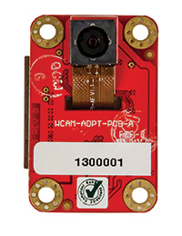
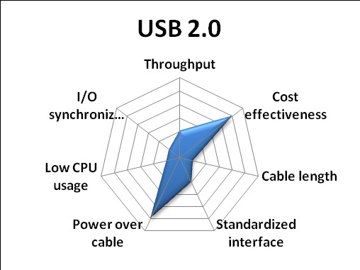
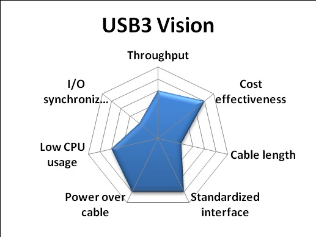

# C-BISCUIT: Design Choices and Justification

## Introduction

Even in these early stages of the C-BISCUIT project, it's already come a long way -- numerous ideas and design goals have been developed in the process. This article will discuss some of these, explaining them so that not only will you better understand what the end goal is, but also why we felt they were most prudent options for creating your own bot. We expect this to be a long project, but we hope you'll enjoy being on the journey with us.

## Project Goals

So where are we headed with the series? Our goal is to provide you with all of the guidance you need to build both land- and air-based drones that can perform environment mapping and video capture duties. In addition, we want the system to be highly customizable -- to this end we'll devise a core system that features the Wandboard and a camera that can be easily and quickly transferred between different platforms, as well as code to function on each.

## Project Constraints

When we initially entertained the idea of a DIY drone article series, we had three major constraints to juggle in order to make it easy to follow:

1. The series had to offer an end product that could do something fairly complex _and_ cool, rather than being a simple string of articles teaching you how to integrate sensors and write navigation algorithms
2. The parts required to build both the core platform and its extensions had to be accessible. This meant that it:
  - Had to be easy to acquire (but see the Cameras selection below)
  - Needed to reach a compromise between high build quality and being relatively inexpensive
  - The parts themselves shouldn't require much hacking to incorporate
3. It had to be something that one could complete without requiring any advanced tooling, including a minimal (but not nonexistent) reliance on budget manufacturing houses regarding some subsystems, e.g. power management boards

## Hardware Subsystems

### The System Core

This subsystem is the fundamental piece that will see the least modification between the C-BISCUIT variants. It includes the Wandboard Quad (along with its antenna and case), and the [Avnet Wandcam](http://www.em.avnet.com/en-us/design/drc/Pages/Wandcam.aspx) (which uses the LI-OV5640-MIPI-AF sensor).

The Wandboard gives us an impressively-powerful, Linux-ready system that will be able to handle our primary computational needs and provide lots of room for extra software. As a bonus, it's easy to reconfigure for another purpose (such as a media PC) if you find you need to. Its main downside is that it doesn't support USB 3.0, which mostly affected the camera options available to the project.

The Wandcam was ultimately chosen over a variety of others because of its low cost and accessibility, as mentioned above. Although it features a rolling shutter ([which can be tricky for robotic vision](https://en.wikipedia.org/wiki/Rolling_shutter#Distortion_effects)), part of our goal was to work around this limitation in software, as low-cost global shutter cameras - whether with the appropriate [MIPI](http://mipi.org/specifications/camera-interface) interface or featuring USB 2.0 - are quite difficult to find.

The final piece of the system core is the RB-Dfr-264 MPU-6050 IMU board. In addition to being a core sensor that will be critical to the drone as a whole, it'll also help us with correcting for the disadvantages in using a rolling shutter camera in lieu of a global shutter. This is a part of the project we intend on putting a lot of effort into.

### Other Subsystems

As the C-BISCUIT project progresses, subsystems and their required hardware will likely shift and change somewhat organically. Our intent is to begin with a basic 4WD platform while we iron out the core Wandboard system, while working towards the ultimate goal of a fully-functional quadcopter that you can use for some cool indoor and outdoor purposes.

## What Didn't Make the Cut

Unfortunately, there were a lot of options we explored on the hardware side that we couldn't use for various reasons. Some of these options were avoided due to cost or availability, but the deciding factor was the [interface](http://www.ni.com/white-paper/5386/en/); many of our options - especially when it came to cameras - were limited to USB 2.0 (with which video processing is computationally expensive) or USB 3.0 (which the Wandboard doesn't support).

We'll list a few of them below, as we might still look into them for later variants, and because we think they're all pretty awesome; just not for our current goals:

**[UI-1221LE-C-HQ](https://en.ids-imaging.com/store/ui-1221le.html):** This is a very nice global shutter camera made by the German company IDS. While it's definitely worth considering for an upgrade later on, the USB 2.0 interface and cost (around $300 US) made it a reluctant scratch for any preliminary design.

**[LI-OV5640-USB-72](https://www.leopardimaging.com/LI-OV5640-USB-72.html):** This USB 2.0 camera was our camera of choice for a while because it could very easily be swapped between builds, but we decided to stick with the MIPI camera to free up more CPU power.

**[Intel RealSense](http://click.intel.com/intel-realsense-developer-kit.html):** The RealSense looked like a lot of fun and is generating a lot of buzz (not to mention, it sits at a great price point at $100), but the USB 3.0 interface made it a no-go for the Wandboard.

**[The Intel NUC Series](http://www.intel.com/content/www/us/en/nuc/overview.html):** No doubt you've heard of these mini-PC systems. We thought long and hard about using one of these in lieu of the Wandboard to expand our USB peripheral options (it _does_ support USB 3.0), but even the least expensive models dwarfed the Wandboard Quad in price point. That's not to say it can't be used for a cool robot: https://www.youtube.com/watch?v=jfAEUkANyaA

## Next Steps

On to software builds and power management!
