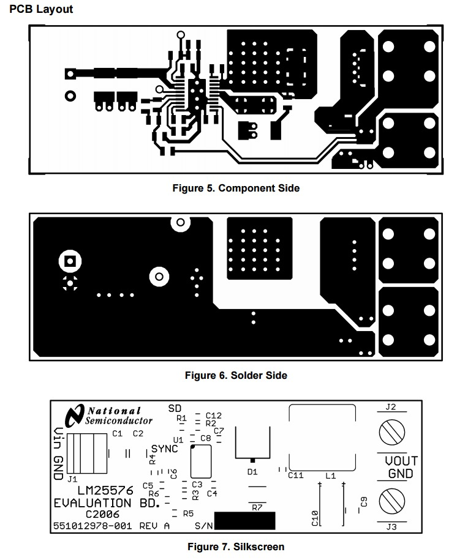

# C-BISCUIT Power: 5V 3A Buck Regulator

_This article is part of an ongoing series to build a robotic platform called [C-BISCUIT](http://www.allaboutcircuits.com/projects/c-biscuit-a-robotics-platform-for-the-hacker-and-hobbyist/). Check out that page for more information and links to other articles._

## Introduction

 
_Top-level power diagram_

The Wandboard in charge of C-BISCUIT requires a regulated 5V DC power supply, generally assumed to be a wall wart with a barrel jack. In order to make the robot mobile, the Wandboard will operate with a 3-cell LiPo battery with a nominal voltage of about 11.1V. It goes without saying that his needs to be regulated to 5V before going to the Wandboard and since the batteries can source a huge amount of current, it's very wise to include some protection circuitry in case over-voltage / over-current conditions occur (this will be covered in a future tutorial).

This article will present a design of a 5V-3A switch mode power supply (SMPS) with a buck topology based on the Texas Instruments [LM25575](http://www.ti.com/product/LM25576) switching regulator. The LM25575 was chosen since in addition to a well documented [datasheet](http://www.ti.com/lit/ds/symlink/lm25576.pdf) (PDF), TI also provides a [reference design](http://www.ti.com/lit/ug/snva217c/snva217c.pdf) (PDF) with example schematic and board layout as well as a [design worksheet](http://www.ti.com/lit/an/snva212b/snva212b.pdf) (PDF) to modify the design for other applications. See the [technical documents](http://www.ti.com/product/LM25576/technicaldocuments) tab for more resources.

The power supply is a generally much overlooked aspect of hobbyist projects so this hopefully will shed some light on what it takes to actually design a custom power solution. There are definitely other options out there and many may be cheaper and easier to build. Adafruit sells a [5V 3A DC-DC converter](https://www.adafruit.com/products/1385) for $10 and you can even purchase the full [Rev. A LM25575 Reference Design Board](http://www.digikey.com/product-search/en?mpart=LM25576EVAL&vendor=296) for $50 or the unpopulated [Rev. B LM25575 Reference Design Board](http://www.digikey.com/product-detail/en/LM25576BLDT%2FNOPB/LM25576BLDT%2FNOPB-ND/1300184) for $20. The goal here is to work through some various aspects of SMPS design so you can create your own down the road.

 
_Rev A Reference Design_

 
_Rev B Reference Design_

## Theory

Typically in a hobbyist project, the simplest way of getting a regulated voltage is to use a linear regulator such as an [LM7805](https://www.fairchildsemi.com/datasheets/LM/LM7805.pdf) (PDF). These are very inefficient, however, and dissipate excess power as heat. Switch-mode power supplies, on the other hand, can operate with very high efficiencies (80% - 95%) but are often more complex circuits and generally require a few more components. Below is a typical schematic of a buck (drop-down) regulator.

 
_Generic buck regulator topoplogy_

SMPS's operate on the principle that in an inductor, current can't change instantaneously, and in a capacitor, voltage can't can't change instantaneously. From circuits class, this can be described with the following differential equations:

 and 

When the switch, **S** (generally a MOSFET of some kind), is closed in the above schematic, current (**IL**) begins to flow though the inductor, **L**. This current flows into the capacitor, **C**, and the load resistor, **R**, which induces a voltage on them (**Vo**) that increases from 0V to **Vi**. This also reverse biases the recirculating diode, **D**. If **S** is opened before **Vo** equals **Vi**, the current in the circuit doesn't stop instantaneously due to the inductor, so it continues to flow through the loop created with the diode. As the energy of the circuit dissipates, **Vo** will decrease toward 0V. You can see that if this open/close process is continued, the output voltage can be maintained.

There is inherently some voltage and current ripple in the output but it's possible to get these values well into acceptable levels for most applications. Output characteristics are dependent on the inductance, output capacitance, switching frequency, and even board layout. Most regulator ICs also include some form of closed-loop feedback to maintain stable output. For more info, here's an interesting article on the [Effects of High Switching Frequency on Buck Regulators](http://www.onsemi.com/pub_link/Collateral/TND388-D.PDF) (PDF).

## TI Reference Design

 

The LM25576 incorporates several "nice to have" features that are included in the reference design.

* Soft start
* Over-current limiting (4.2A)
* Closed loop [current mode control](http://www.ti.com.cn/cn/lit/an/snva555/snva555.pdf) (PDF)
* Shutdown / standby mode (not populated)

The physical layout of the board is provided only as images in the PDF (no Gerber or EDA files) so our layout is recreated manually in KiCad (with some minor modifications). Some important features to note are the copper pours for the recirculating diode and inductor. The pours are on both the top and bottom copper layers and numerous vias connect them together. This via stitching is done as a form of thermal relief and allows the copper areas to be used as heatsinks when these parts get hot under heavy load conditions. As part of the design, these top pours also have their soldermask omitted so that more heat can be dissipated. There is also via stitching underneath the regulator itself which connects the exposed pad of the IC to the bottom ground plane.

 

## KiCad Implementation

The design we are implementing uses most of the same parts (see the BOM in the reference design PDF), substituting cheaper passives and different input and output terminals. The pads on most of the parts are also slightly larger since this project is designed to be soldered by hand if necessary.

 
_Schematic_

 
_Board layout_

 
_Pretty 3D rendering in [OSHPark purple](https://oshpark.com/)_

## Design Files

All the design files are available on [Github](https://github.com/AllAboutCircuits/C-BISCUIT/tree/master/core/power) or as a self-contained ZIP file. Included in the ZIP file are the schematic, layout, and BOM files as well as part libraries and datasheets.

<a href="./assets/buck-reg-5v.zip">buck-reg-5v.zip</a>

## Moving Forward

The next step in the C-BISCUIT power series (in addition to assembly and testing of this board when it gets back from the fab) is a small over-current and over-voltage protection circuit that can be added in-line between the regulator and the Wandboard. In addition, we will be designing a battery power distribution board with hot-swap / shore power capabilities and voltage / current monitoring. For more information on other applications of the buck regulator, check out David Knight's article [here](http://www.allaboutcircuits.com/technical-articles/buck-converters-and-their-cool-applications/).

Until next time, happy hacking...
