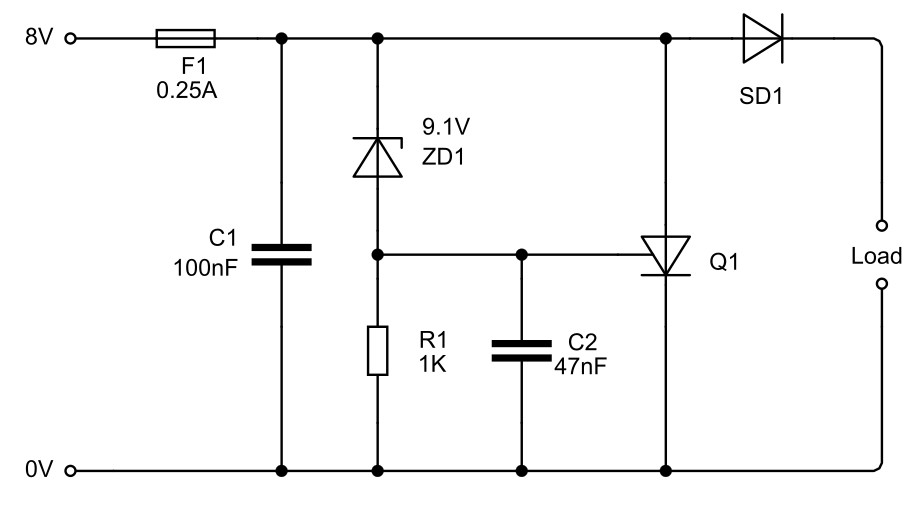
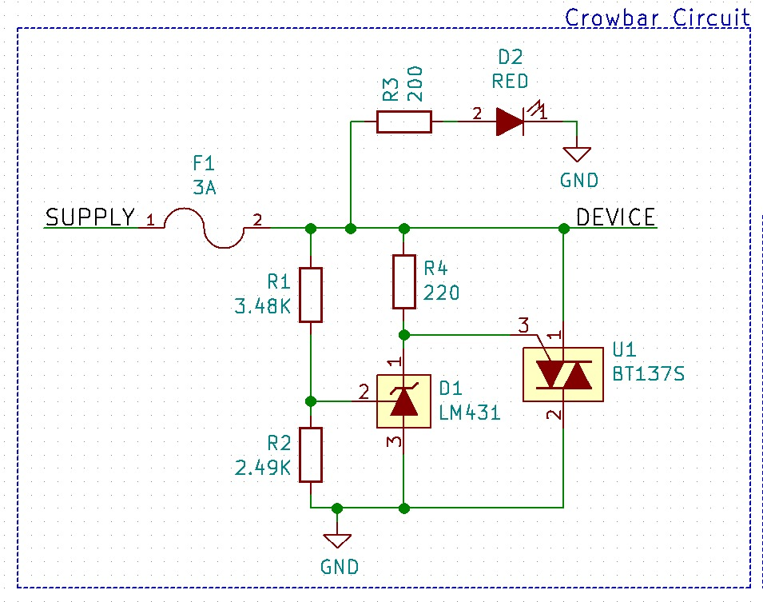
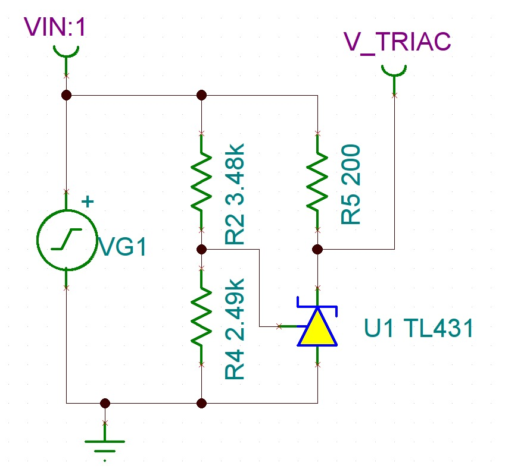
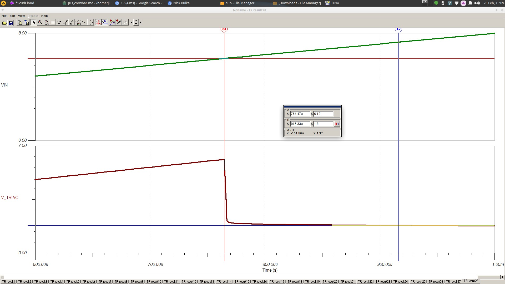
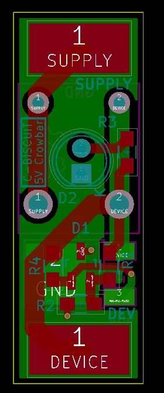
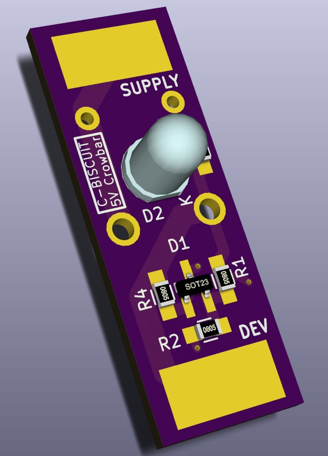
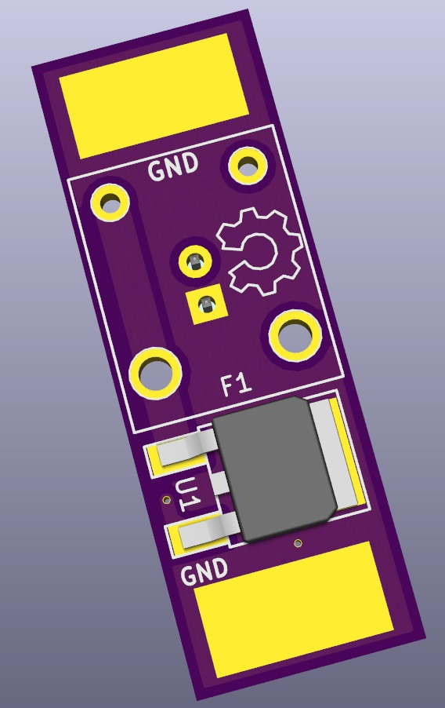

# C-BISCUIT Power: Crowbar Protection Circuit for 5V Regulator

_An overview of the C-BISCUIT power system_

## Introduction
In the previous C-BISCUIT article, we designed a DC-DC power converter to regulates our ~11V battery voltage to a nice, clean 5.0V. In an ideal world, this is all we'd ever need but the world is far from that and we need to consider protection circuitry in the event of upsets, namely over-voltage and over-current conditions. One way of doing this is with something called a "crowbar" circuit.

_A generic 9.1 V, 250 mA crowbar circuit that uses a silicon controlled rectifier, or SCR, to short the output terminals_

If the voltage rises above a pre-determined level (9.1 V in the example above), a semiconductor (either a TRIAC or SCR) shorts power and ground... as if you threw a crowbar across the terminals.This forces a lot of current through the device but immediately lowers the voltage. An inline fuse will then electrically disconnect the load (the Wandboard in our case) from the supply. The trigger voltage is set by a Zener diode. In the case of an SCR, when the Zener diode breaks down, a voltage appears on the gate terminal of the SCR. If this is above the critical threshold to activate the SCR, it turns on.

## Our Crowbar Circuit

The one that we're implementing is a little different. We're incorporating an adjustable Zener diode (technically an "adjustable precision Zener shunt regulator") from TI called the [LM431](http://www.ti.com/product/LM431) and a [TRIAC](http://www.radio-electronics.com/info/data/semicond/triac/what-is-a-triac-basics-tutorial.php) as opposed to an SCR. The diode breaks down whenever the voltage at the reference input reaches 2.5 V. This means it can be set to pretty much any level with a simple voltage divider. **R1** and **R2** were chosen such that the limit voltage is just about 6 V.

You'll notice that the resistor and the Zener are reversed in this implementation. That's due to the fact that TRIAC and the SCR don't trigger in the same way. The LM431's cathode current when off is about 1 uA. This means there is a very small voltage drop across **R4**, essentially keeping MT1 and the gate of the TRIAC at the same voltage. When the trigger voltage is reached and the Zener breaks down, current begins to flow through **R4**, causing a larger drop across it.

This puts the TRIAC into what's known as [quadrant 3 operation](https://en.wikipedia.org/wiki/TRIAC#Quadrant_3), since both MT2 and the gate are at lower potentials than MT1. Essentially, a small amount of current flows from MT1 to the gate which causes a large amount of current to flow from MT1 to MT2. If this is more than a few milliamps, the TRIAC "latches" (latch current) and stays conducting until that current is less than a quantity known as the holding current.

When the TRIAC conducts, a 3A automotive fuse will blow, protecting the circuit. There's also a handy, dandy LED to let you know if the fuse has blown or not.

## Simulation

With most analog circuits, it's a very wise idea to simulate the design before prototyping. SPICE is the de facto tool for this and comes in [many different flavors and variants](http://electronics.stackexchange.com/questions/18760/comparison-between-spice-simulators). Essentially a numerical differential equation solver for circuit primitives, SPICE can be used to give you a good approximation of real-world circuit performance. However, non-trivial circuits involving complex ICs can often be challenging to model. [LTSpice IV](http://www.linear.com/designtools/software/) is a popular simulator and most LT parts have free SPICE models available for download. I wanted to simulate the TRIAC trigger circuit and set out to find a model for the Zener diode. TI doesn't provide any models for the LM431, but they do offer several for the [TL431](http://www.ti.com/product/TL431/toolssoftware), which should have similar circuit behavior.

After attempting to adapt the HSPICE and PSPICE models to LTSpice with lackluster results, I ended up downloading [TINA-TI](http://www.ti.com/tool/tina-ti) (TI's flavor of SPICE simulator) and using the encrypted TINA module of the TL431. My transient analysis file is located in the ZIP file at the bottom of the page in the _sim_ directory.

_TINA schematic_

_1 ms transient analysis simulation (click for full size)_

From the transient analysis, we can see that once the input voltage reaches just about 6V, the Zener breaks down and the TRIAC gate voltage falls to 1.8V this is below the gate threshold voltage for Q3 operation and so we can safely assume that the TRIAC will start conducting and latch open until the fuse blows.

## Layout

This circuit is supposed to be small and unobtrusive. It's skinny and long (13mm x 37mm), which makes it possible to be soldered inline betweeen the regulator and the Wandboard with some protective heat shrink over it. The LED is technically optional but you can cut a small slit in the heatshrink for the LED to peek out of to give you a visual indicator of connectivity.

_PCB layout in KiCad_

_Rendering (Top)_

_Rendering (Bottom)_

## Design Files

All the design files are available on [Github](https://github.com/AllAboutCircuits/C-BISCUIT/tree/master/core/power) or as a self-contained ZIP file below. Included in the ZIP file are the schematic, layout, and BOM files as well as part libraries and datasheets.

<ZIP>

## Moving Forward

The last component to be designed for the power system is a power distribution board that the batteries connect to. It will allow hot swapping the batteries without having to shut down anything and will contain monitoring circuitry for both battery voltage and current that can talk over a standard interface like SPI or I2C. We also need to get the previously designed boards populated and test their functionality. After that, the software design will begin. See you then... same bat time, same bat channel!
