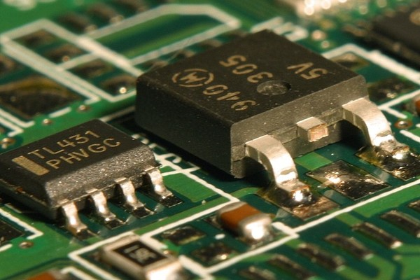

# C-BISCUIT Power: Crowbar Protection Circuit for 5V Regulator

## Introduction
It will also incorporate a "crowbar" circuit which provides over-voltage protection and a 3A fuse for over-current protection.

## The Crowbar Circuit

## Layout
