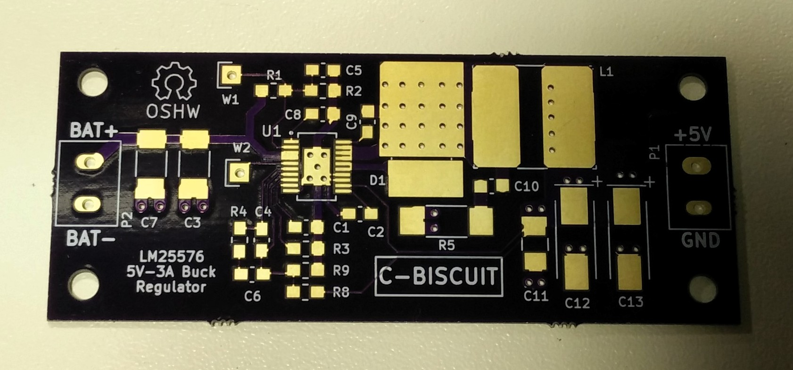
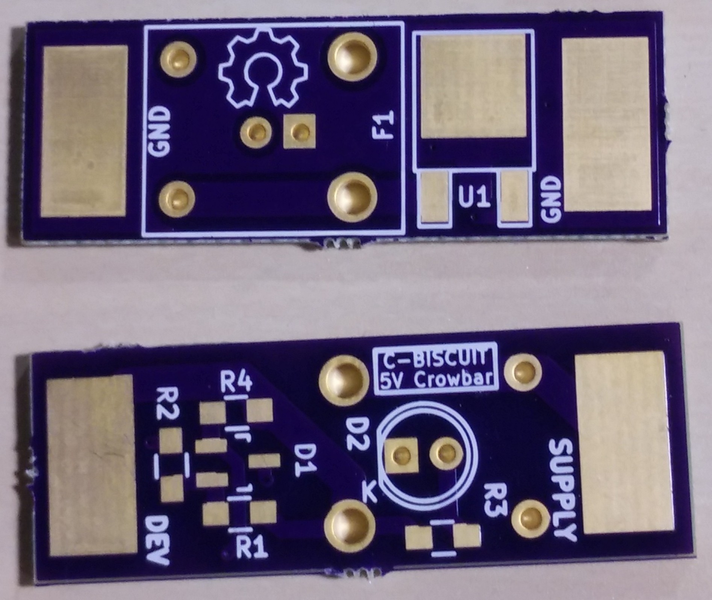
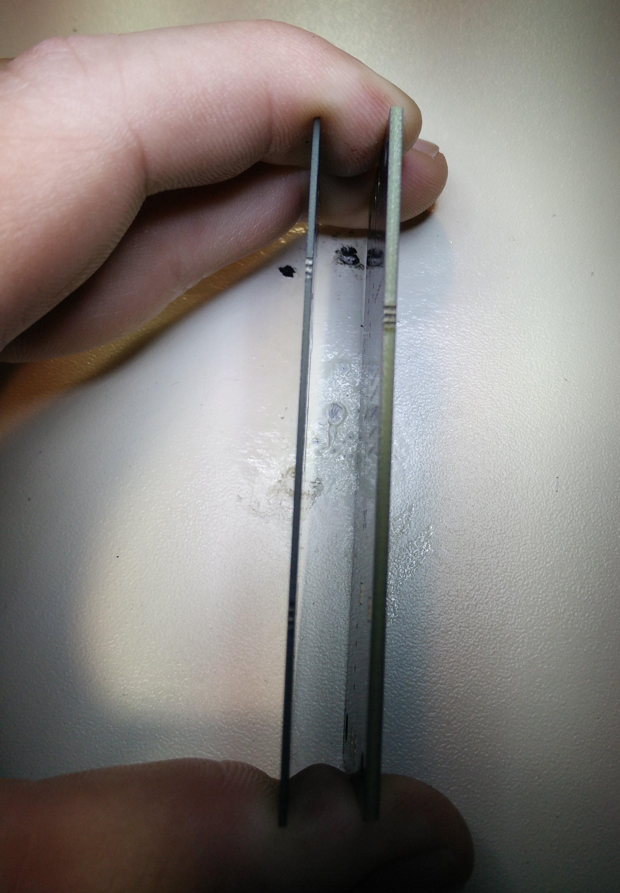
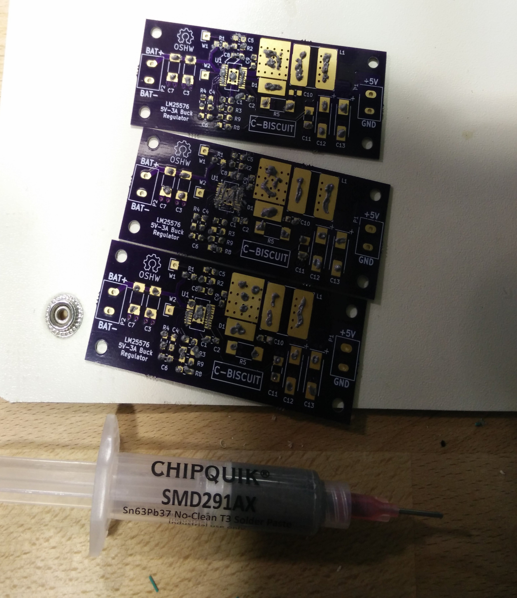
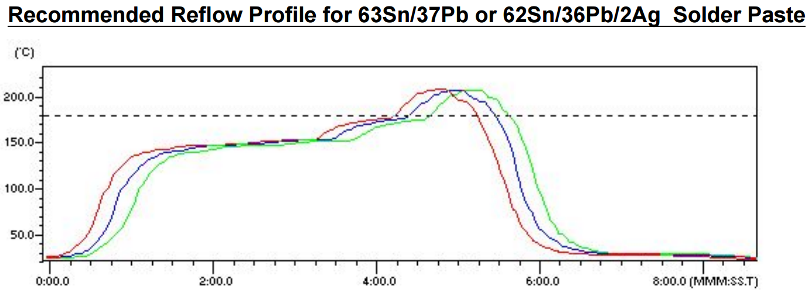
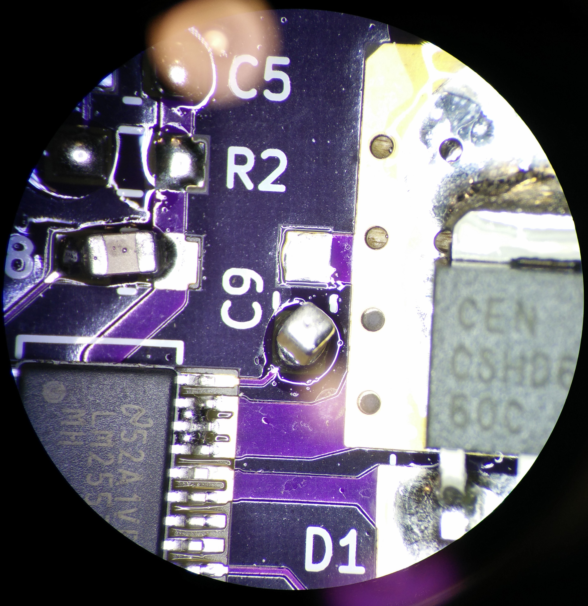
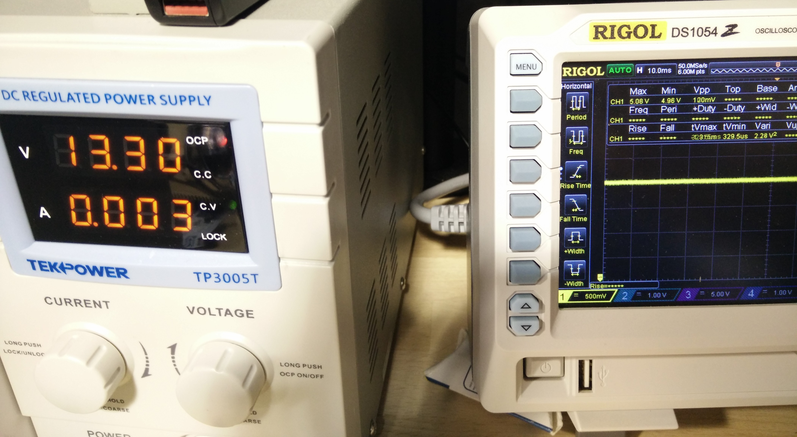
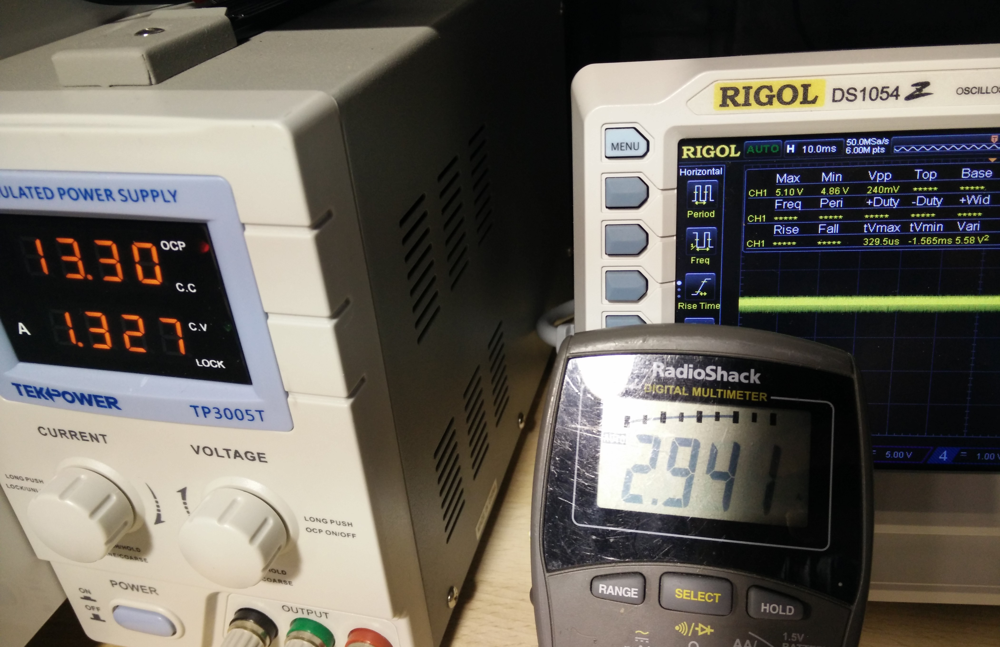

# C-BISCUIT Power: Assembly and Test

_This article is part of an ongoing series called [C-BISCUIT: A Robotics Platform for the Hacker and Hobbyist](http://www.allaboutcircuits.com/projects/c-biscuit-a-robotics-platform-for-the-hacker-and-hobbyist/)_

## Introduction

Today we meet at the crossroads of theory and practice by putting together and testing the 5V regulator and crowbar circuits we designed back in [this article](http://www.allaboutcircuits.com/projects/c-biscuit-power-5v-3a-buck-regulator-for-wandboard/). We're going to cover some of the practical aspects of SMD soldering and some of the "gotchas" that you need to be aware of. For this tutorial I used the following tools and materials:

* [OSHPark](https://oshpark.com/) PCBs and parts from the BOM (design files found [here](http://www.allaboutcircuits.com/uploads/articles/buck-reg-5v.zip))

_Regulator PCB_

_Crowbar PCB (Top / Bottom)_

* [Hot air rework station](http://www.amazon.com/Kohree-Digital-Rework-Station-Solder/dp/B00ITMPQS2/ref=sr_1_1?ie=UTF8&qid=1463945705&sr=8-1&keywords=hot+air+rework)
* [Soldering iron](http://www.amazon.com/Hakko-FX888D-23BY-Digital-Soldering-FX-888D/dp/B00ANZRT4M/ref=sr_1_1?ie=UTF8&qid=1463945759&sr=8-1&keywords=hakko+fx-888d) with [sharp conical tip](http://www.amazon.com/Hakko-T18-I-Soldering-FX-8801-Conical/dp/B004OR6BZ8/ref=pd_sim_469_1?ie=UTF8&dpID=21nF-NecNnL&dpSrc=sims&preST=_AC_UL160_SR160%2C160_&refRID=1428P0D1KH6RMDP7PT5F)
* [Desoldering wick](http://www.amazon.com/Aven-17541-Desoldering-Wick-Width/dp/B019IU26UO/ref=sr_1_4?ie=UTF8&qid=1463945819&sr=8-4&keywords=desoldering+braid)
* [Stereo microscope](http://www.amazon.com/AmScope-SM-3TZ-80S-Professional-Trinocular-Magnification/dp/B0091V1DLY/ref=sr_1_5?s=industrial&srs=3016947011&ie=UTF8&qid=1463945943&sr=1-5&keywords=amscope+trinocular)
* [Oscilloscope](http://www.amazon.com/Rigol-DS1054Z-Digital-Oscilloscopes-Bandwidth/dp/B012938E76/ref=sr_1_1?ie=UTF8&qid=1463946007&sr=8-1&keywords=rigol+ds1054z)
* [Multimeter](http://www.amazon.com/Mastech-MS8268-MS8261-Digital-Multimeter/dp/B000JQ4O2U/ref=sr_1_7?ie=UTF8&qid=1463946032&sr=8-7&keywords=multimeter)
* [Leaded soldering paste in syringe](http://www.amazon.com/SOLDER-PASTE-REWORK-SN63-SYRINGE/dp/B00B88CDLM/ref=sr_1_12?srs=2587208011&ie=UTF8&qid=1463946165&sr=8-12&keywords=solder+paste)
* [Anti-static tweezers](http://www.amazon.com/OPCC-Non-magnetic-Tweezers-Anti-static-included/dp/B00Y1U10HC/ref=sr_1_3?ie=UTF8&qid=1463955605&sr=8-3&keywords=esd+tweezers)
* Variable resistor
* Bench power supply

It's not crucial to use the exact tools listed above. Some of them are pretty expensive and I had several of them available through work. There are cheaper alternatives to some things like [this microscope from Adafruit](https://www.adafruit.com/product/636) or [this USB oscilloscope from Digilent](http://store.digilentinc.com/analog-discovery-2-100msps-usb-oscilloscope-logic-analyzer-and-variable-power-supply/). The most important tools were the hot air rework station and the solder paste syringe. Another very useful SMD rework tool to have is an [industrial hot plate](http://www.amazon.com/Scilogex-86143101-MS-H280-Pro-Circular-Top-Magnetic/dp/B00AYGIFCA/ref=lp_318002011_1_2?s=industrial&ie=UTF8&qid=1463950757&sr=1-2). This lets you get the entire board to a consistent temperature so that you don't have to put too much excessive heat into the components on the top of the board. 

The board from OSHPark was ordered with a new option they started offering which was [half-thickness FR4 (0.8mm) with double thickness (2 oz. / 70um) copper](http://docs.oshpark.com/services/two-layer-hhdc/). This allows better thermal and weight characteristics but increases the capacitance between the top and bottom layers.

_Half thickness PCB compared to regular thickness_

## Populating the PCBs

The first order of business is to use the solder syringe to put a dollop of solder on each surface mount pad. It's pretty straightforward for the resistors and capacitors, but on the voltage regulator, the inductor and DPACK diodepads had a little more solder than is probably necessary. My rationale for this was that since these components are designed with heat dissipation in mind, it's crucial to have a solid thermal connection to the top copper layer. The solder paste on the pads of the LM25576 doens't have to be perfect and can overlap the pads a bit. The whole idea is that the surface tension of the solder will cause it to stick to the closest pad and lead, and away from the solder mask.

Next, using the schematic of the [regulator](http://www.allaboutcircuits.com/uploads/articles/buck-reg-5v-no-crowbar-schem.jpg) and the [crowbar](http://www.allaboutcircuits.com/uploads/articles/crowbar-6v.jpg) and the layout files, carefully place the surface mount components on their correct pads paying extra special attention to IC and capacitor polarity. Once you've checked (and double checked) that everything is correct and in place, move on to the next section which uses the hot air reflow station to solder the pieces in place.

## Full of Hot Air

This is a recommended reflow oven temperature profile for the particular type of solder paste I listed above:

The idea is to warm everything up to around 150 degrees C and then increase the temperature to about 200 degrees C for a short while. The timing can be a little tricky (which makes having a reflow oven oh so nice!) but for these one-off boards, we can afford a bit of leniency with temperature. Keep in mind that many parts of the board are specifically designed as heat sinks which is why preheating everything is important for getting everything to reflow properly. This is where the optional hot plate would come in handy.

In my case, I managed to unequally heat up one of the regulator boards causing two of the capacitors to "tombstone" where it sits upright off the pad like so:

The trace connecting the LM25576 to C9 is very thin compared to the one connected to the diode and it's massive copper pour area. This caused the solder to melt first on the small trace's pad and the surface tension pulled the capacitor into it's upright position. While annoying, this error can be easily fixed by hand in the next section. 

**NOTE:** There was an issue with the DigiKey order where instead of 22uF ceramic output capacitors, I was shipped a batch of 0.22uF capacitors. I left those parts unpopulated in the meantime while I get more in but it may affect voltage ripple during the tests. 

## Fixing Errors and Hand-Soldering the Other Components

Now it's time to break out the soldering iron -- both to correct mistakes and add the rest of the through-hole components. One of my more problematic areas was the fine-pitch leads on the LM25576. Some of the traces on the chip are connected together on the PCB to allow for higher current to flow, so it's fine if some of the solder transferred up the pins making bridges (see pins 17, 18, and 19 in image above) but on other pins, it could mean letting out the magic smoke when powering on. Use the desoldering wick and a little solder to remove the shorts if any.

Now for the through hole components. The screw terminals and fuse holder require, in addition to a solid electrical connection, a strong mechanical connection to withstand the replacement of fuses and swapping out connector wires. **NOTE:** On the crowbar layout, it looks like I laid out the fuse clips backward. In order to keep the fuse in the board outline, I attached the fuse clips to the opposite side of the board. The required putting the LED on the opposite side of the board as well. 

Once everything is soldered up, you should have a few boards that look something like this:

[finished board pics](fuck-you)

## Testing

So the boards look fine but it's all for nothing if it doesn't meet spec. As the old saying goes: "the proof is in the pudding".

### Contestant #1: 5V 3A Buck Regulator

First we need to test the open circuit output voltage using the bench power supply and an oscilloscope. A multimeter may suffice for DC measurements but it won't show you any transient properties like rise time or voltage ripple. I did find the multimeter very useful for current measurement, however. A current probe for the oscilloscope would have been ideal but unfortunately I didn't have one available.

Turning on the bench supply 10 13.3V (above what we'd expect a full battery charge to be), the output waveform looks like this: 

_5V output with 120mV ripple_

So far so good since nothing is on fire but 120mV peak to peak voltage ripple is a bit high for a 5V rail (that's 2.4%). The [evaluation board documentation](http://www.ti.com/lit/ug/snva217c/snva217c.pdf) demonstrates an output ripple of less than 50mV. Let's see what it looks like under ~3A load:

Double the ripple but still within 5% under full load (4.8%). Hopefully the low ESR of the ceramic caps will mitigate some of this when it comes in. In the [Wandboard schematic](http://www.wandboard.org/images/downloads/wbquad-revb1-userguide.pdf) it shows several LDO linear regulators that it uses for actually delivering power to the processor. The 5V rail is used more for peripherals like HDMI and USB. If it causes issues, I'll modify the design to include a 5V LDO on the output just to eat some of that ripple.

### Contestant #2: The Crowbar

[TPS2065](http://www.ti.com/lit/ds/symlink/tps2066.pdf) Power Distribution Switch for Host USB: rec 5V5, max 6v0
[TPS2061](http://www.ti.com/lit/ds/symlink/tps2066.pdf) "": ""
[AME8816](http://www.ame.com.tw/Product/Datasheet/AME8816.pdf) 3v3 reg: 8v0 max

## Conclusion
This is the best thing in da warld. The end.

